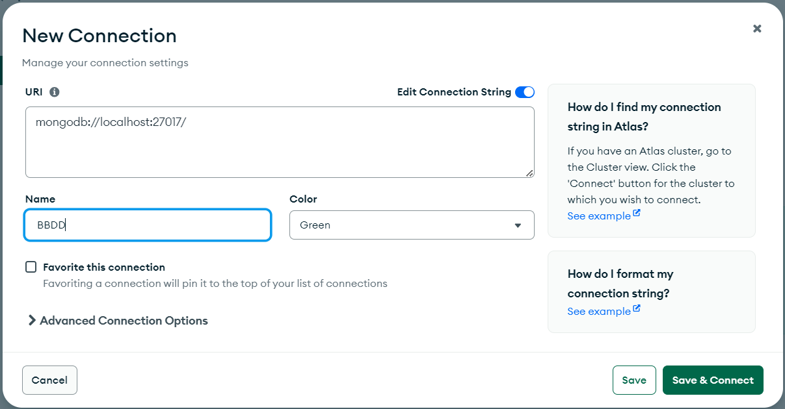

<p align="center">
  <a href="http://nestjs.com/" target="blank"></a>
</p>

## Docs

  ``https://docs.nestjs.com/first-steps``

  ``https://github.com/Klerith/mas-talento/tree/main/nest``

  ``https://cursos.devtalles.com/pages/mas-talento``

  ``https://hub.docker.com/_/mongo/tags``

## Desinstalar paquetes (opcional)
```
  npm uninstall eslint-config-prettier
  npm uninstall eslint-plugin-prettier
  npm uninstall prettier
```

## Docker

1. Crear el fichero ``docker-compose.yml`` con la información correspondiente.

2. Creamos en el ``package.json`` el siguiente script para levantar docker:

      ```
      "scripts": {
        ...
        "docker:up": "docker compose up -d"
      },
      ```
      - Con ``docker compose`` ejecutamos ``docker-compose.yml``, ``up`` es para que lea y monte siguiendo las instrucciones del fichero y ``-d`` para que aunque cierres la terminal, el proceso siga en pie.

      - En el fichero ``.gitignore`` podemos añadir ``/mongo``.

      - Crearemos en mongo compass una nueva conexión:

        <p align="center">
          <a href="http://nestjs.com/" target="blank"></a>
        </p>

      ``
        PS 12-nest-backend> nest g resource auth
      ``
      ``
        ? What transport layer do you use? (Use arrow keys)
      ``
      ``
        ❯ REST API
      ``
      ``
        ? Would you like to generate CRUD entry points? (Y/n). Y
      ``


